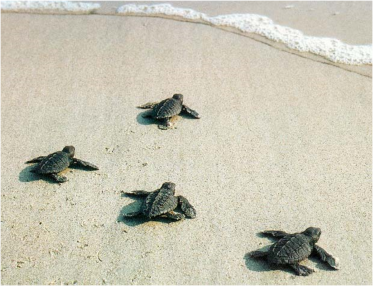
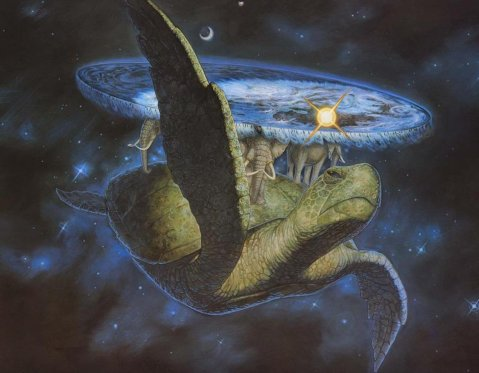

.. include:: <s5defs.txt>

=====================================
Web Crawling and Metadata with Python
=====================================

:Author:  Andrew Montalenti
:Date:    $Date: 2012-10-26 09:00:00 -0500 (Tues, 23 Oct) $

.. This document is copyright Andrew Montalenti and Parsely, Inc.

.. container:: handout

    **How this was made**

    This document was created using Docutils_/reStructuredText_ and S5_.

    It is the introductory NLP course given by Parsely, Inc. to
    the newest generation of Python hackers.

    Simplicity begets elegance.

.. _Docutils: http://docutils.sourceforge.net/
.. _reStructuredText: http://docutils.sourceforge.net/rst.html
.. _S5: http://meyerweb.com/eric/tools/s5/

Meta Information
----------------

**Me**: I've been using Python for 10 years. I use Python full-time, and have for the last 3 years.

**Startup**: I'm co-founder/CTO of Parse.ly_, a tech startup in the digital media space.

**E-mail me**: andrew@parsely.com

**Follow me on Twitter**: amontalenti_

**Connect on LinkedIn**: http://linkedin.com/in/andrewmontalenti

.. _Parse.ly: http://parsely.com
.. _amontalenti: http://twitter.com/amontalenti

Outline
-------

* what Parse.ly does and how it does it
* how web data and crawlers play a role
* why bother building crawlers?
* difference between "crawling", "scraping", and "spidering"
* scaling challenges unique to web crawling
* why you don't want to use Apache Nutch
* why you probably shouldn't use Heretix, either
* how you'd build your own crawler in Python
* why you don't want to build your own crawler
* brief introduction to scrapy
* some scrapy examples
* overview of scrapy cloud
* scrapy toolbox: w3lib, scrapely, slybot
* brief introduction to semantic web metadata (practical, not theory)
* a look at metadata on publisher sites
* reason for creation of Mr. Schemato (http://schema.to)
* short presentation on schemato
* how crawling and metadata relate, and what it means to you

Slide Zero
-----------

Simplicity begets elegance.

Baby Turtles
------------

Use your powers wisely, and always remember...

Magic Turtles!
--------------

It's turtles all the way down!

